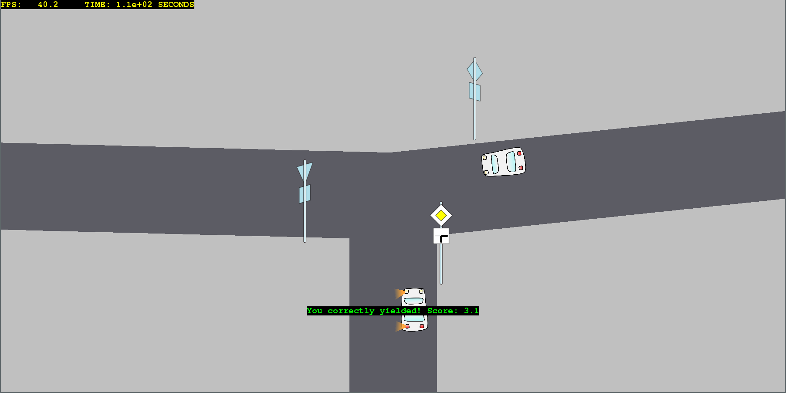
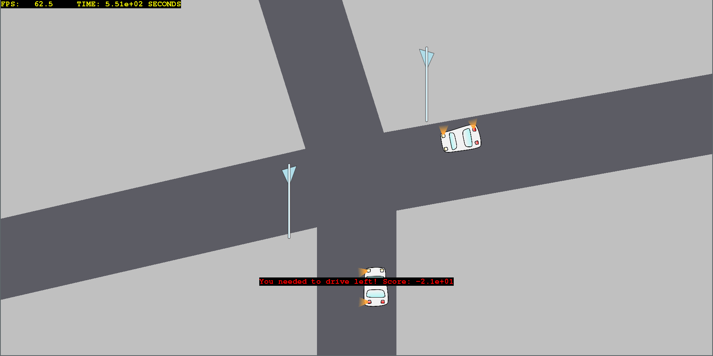
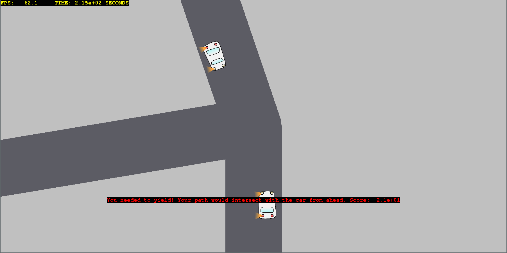

Train yourself to instantly know the right-of-way rules!

I feel that one needs a lot of practice in order to get the theory right (at least I do). So I wrote this little game for myself.

## Rules

You should read the rules in a driving manual first (and you may not blame me if you can't learn to drive after playing this). Here's a short summary still (the rules are for continental Europe).

1. If there are no other cars that would touch your path, you can go through.
2. If you are the only one with a right-of-way/priority sign, you must go through first.
3. If the other cars have a yield sign and you don't, then you must also go through first.
4. If everyone has the same level of right-of-way, then you must yield to the vehicle coming from your right, if there is one.
  - There are two kinds of "coming from your right":
    - before you enter the intersection, the care is on the road to your right
    - after you enter the intersection, you would turn left (and a car is coming from the road ahead or to the right). This way, if you were to go left, the other car coming from ahead (North) would hit your right.
5. If you are opposite of someone and both of you want to turn left, in this game you must yield. In practice though, you might be able to go through if both of you keep left of the intersection's center. But I didn't want to code this in the game, and I wouldn't do it in reality either.

## Controls

Press the arrow key corresponding to the correct driving direction within 5 seconds!
To yield (stop), press the down arrow.
Also works with WASD controls.

The final score is currently printed on the console.

Feel free to submit pull requests or suggestions!

## Installing
The project requires Python 3 and PyGame.

To install PyGame:
* On Windows, after installing Python 3: `pip install pygame`
* On Debian: `python3 -m pip install pygame`

## Screenshots

Future possibilities:
- create ending screen to show the final score, instead of printing on console after exit
- stop sign as a random possibility instead of yield sign
	- should stop even if there are no cars
- Image editing: remove car from signal images; stack signal lights over car image instead
- make player car color customizable
- simulate continuation after selecting direction
    - Figure out trigonometrics of turning
	- crashes, explosions and fire! (also sounds)

